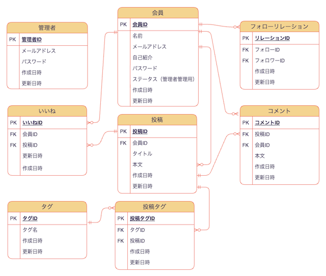
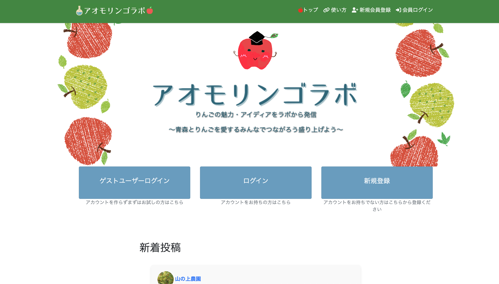
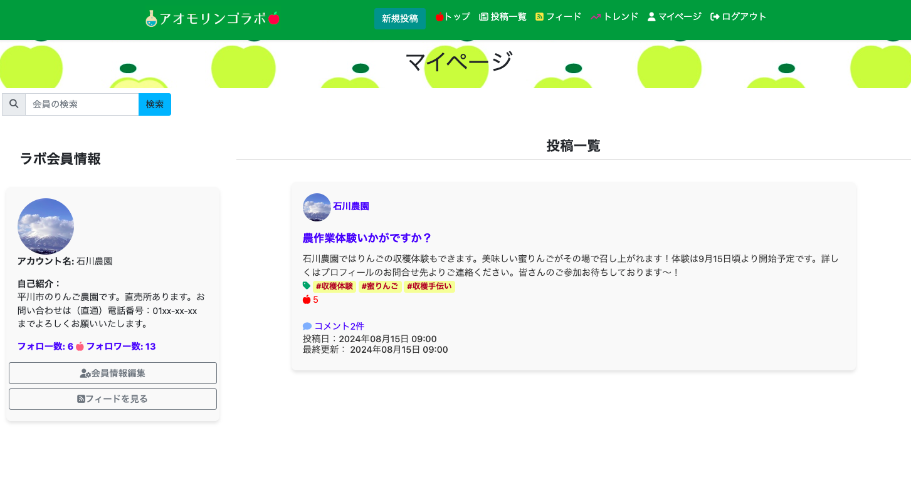
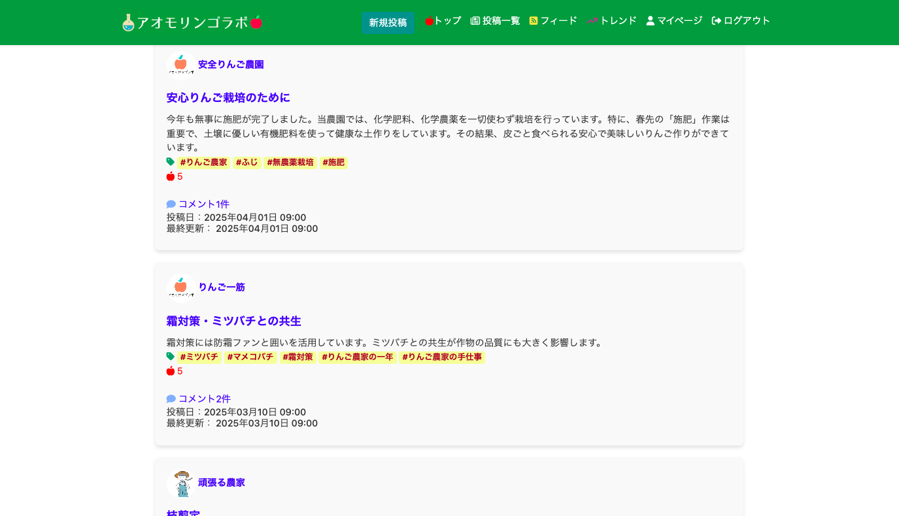

# サイト名：アオモリンゴラボ

## サイト概要
### サイトテーマ：
#### りんごの供給者（農家さん）とりんごの需要者（企業/飲食店/個人）がりんご生産について抱える悩みやりんごの様々なニーズを共有できるコミュニティ型SNSサイト

### テーマを選んだ理由:
#### ・自分が青森県出身でりんご農家の祖父母を見て育ったことがきっかけで、青森のりんご農家の生産をWEB開発で助けたいと考え、このサイトを考えました。
#### ・青森県のりんご生産においては、生産量の約１０％（４万トン、個数にして１億３千万個）が市場に出回らず、規格外品として廃棄されるか、農家自身で消費されており、農家への利益還元ができないものもあり、有効活用すべきと考えました。
#### ・りんごの活用は青森県の農業を支えるだけでなく、SDGsの観点でもフードロスの削減の一助になります。また、災害時のりんご救済にもつながる可能性があります。このように、サイトを通じて、農家とりんごに興味関心のある消費者や企業をつなげ、りんご生産で抱える課題や、りんごのニーズを共有し合うことで、新しい有効活用のアイディアや、ビジネス創出につなげたいです。
#### ・最終的にはサイトを通じたデータ収集によって青森県内のりんご生産農家が抱える悩みや話題、規格外りんごの活用方法をデータで可視化し、農家の皆さんに還元できるようにしたいと考えております。

### ターゲットユーザ:
#### ・りんご生産者
#### ・りんごが好きな消費者
#### ・りんごを活用する飲食店や、加工業者など
#### ・SDGsに興味関心のある消費者・企業

### 主な利用シーン:
#### ​・農家でりんごの生産状況を広く紹介したい時 （農家さん同士、農家さん×ビジネスをつなげる目的）
#### ・りんごを必要としている飲食店や加工業者のニーズを共有したい時 （農家さん×ビジネスをつなげる目的）

### 基本機能：
| 機能名 | 概要 |
| ----- | --- |
| 投稿機能 | りんごに関する文章・写真の投稿および閲覧 |
| コメント機能 | 投稿に対するコメント投稿、削除 |
| フォロー・フォロワー機能 | 会員は相互に他の会員をフォローをすることができる |
| いいね機能 | 投稿に対して「いいね」ボタンを押すことができる | 
| フィード | フォローしているユーザの投稿、いいねをした投稿の一覧表示 |
| トレンド | 人気タグの表示、興味関心が高い投稿のレコメンド |
| 管理者機能 | ユーザー・投稿・コメントの管理、不適切な投稿削除 |

## 設計書
#### ER図

#### 画面

​

## 開発環境
- OS：Amazon Linux
- 言語：HTML,CSS,JavaScript,Ruby,SQL
- フレームワーク：Ruby on Rails 3.1.2
- Ruby on Rails： 6.1.7.10
- IDE：VS Code（リモートSSH接続 / EC2）
​
## 使用素材
#### 著作権を考慮し、サイトに掲載する企業名等のデータは全て架空のデータです。なお今後、実在するデータを利用する際には、事前に著作権保持者と契約を結んだ上で利用します。

#### 利用した外部サービス
#### photoAC （ https://www.photo-ac.com/ ）
#### illustAC （ https://www.ac-illust.com/ ）
#### Fontawesome （ https://fontawesome.com/ ）
#### Canva （https://www.canva.com/）
